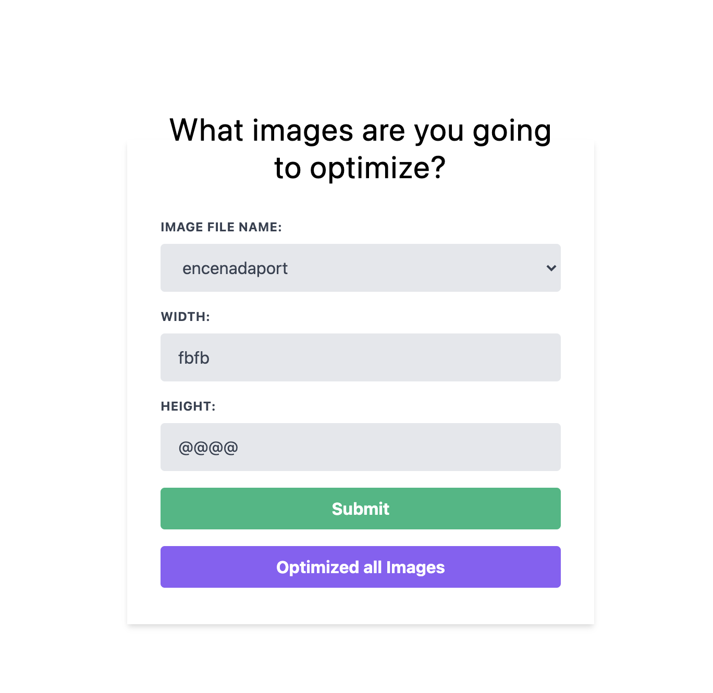

# Image Processing API

This project aims to give you a real-world scenario in which you would read and write to your disk via a Node.js express server rather than a database. 

The project you create serves two purposes: to prepare you for setting up scalable code and architecture for real-world projects and tie together some of the most popular middleware and utilities found in Node.js projects.

###Requirement

- The scripts needed to test/start/build your application
- Any endpoints that should be accessed to test
  that you have created the required functionality
- The reviewer should be able to delete your thumbnail
  images and see them recreated when accessing
  the appropriate endpoints, and then see that
  they are not being recreated
  
## Getting Started

Step 1: Install Dependencies
```bash
npm install
  or
yarn install
 ```

Step 2: Running the server

```bash
npm start
  or
yarn start
 ```

Step 3: Go to your browser: [http://localhost:3002](http://localhost:3002)

Step 4: Process images

Choose one of image file name and type width and height.
Moreover, you can choose optimized all of image files as well.

## Testing

```bash
npm run test
# or
yarn run test
```

### Result



### Learning Resources

[jasmine Official Document](https://jasmine.github.io/api/3.6/matchers.html)

## License

This project is authorized MIT License

